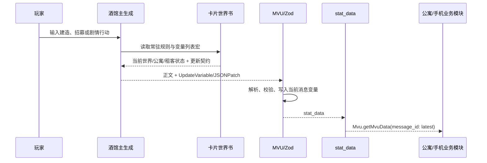

# 房东模拟器 Z5.20：小手机酒馆助手脚本与业务联动链路审计

> 审计对象：[示例/房东模拟器Z5.20.png](</D:/STOBJECT/实时编写角色卡和世界书/tavern_helper_template/示例/房东模拟器Z5.20.png>)
> 审计日期：2026-07-20
> 方法：解析 PNG `tEXt/chara` 元数据中的 `chara_card_v3` JSON；未假定本仓库存在对应源码。
> 结论性质：静态源码审计。没有向真实酒馆导入角色卡、没有写入用户的 ChatLore、聊天变量或 API 设置。

## 先给结论

“小手机”不是一个单独的界面脚本，而是一组以内嵌脚本 **`小手机主程序`** 为根、通过 `window.parent.PhoneSystem` 通信的手机系统。它有三条彼此独立、但会在部分节点汇合的数据链：

1. **剧情状态链（MVU）**：正文 AI 的 `<UpdateVariable>` → MVU 解析与 Zod 校验 → 当前消息的 `stat_data`。公寓 UI、小手机时钟、天气、新闻、租客分析从这里读取事实状态。
2. **手机聊天链（IndexedDB）**：手机聊天 UI → `ChatDB` 的浏览器 IndexedDB → 副 API 回复。它默认不创建酒馆正文楼层。
3. **提示词回写链（ChatLore / 聊天世界书）**：手机聊天完成后，`ChatSync` 将最近聊天压缩成摘要，写入**当前酒馆聊天的 ChatLore**。该条目被配置为常驻系统提示词，因此会在**下一次正文生成**进入模型上下文。

也就是说：手机聊天不是“直接改正文”，而是“本地聊天完成 → 0.5 秒防抖 → 写 ChatLore 摘要 → 下一轮正文请求读取”。若 ChatLore 写入失败而只落到聊天变量，卡内并没有另一个世界书条目去读取该备用变量，因此正文不会自动获知。

```mermaid
flowchart LR
    U[用户在酒馆发送正文] --> WB[角色卡世界书\n变量规则/变量列表]
    WB --> LLM[酒馆主 API 生成正文]
    LLM --> UPD[UpdateVariable + JSONPatch]
    UPD --> MVU[MVU + Zod]
    MVU --> STAT[当前消息 stat_data]
    STAT --> APT[掌上公寓 UI]
    STAT --> PHONE[小手机时钟/新闻/天气/分析]

    PUSER[用户在小手机聊天] --> DB[IndexedDB: TenantChatDB]
    DB --> PAPI[小手机配置的副 API]
    PAPI --> DB
    DB --> SYNC[ChatSync: 摘要 + 500ms 防抖]
    SYNC --> LORE[当前聊天 ChatLore\n[租客微信]姓名]
    LORE --> WB
```

---

## 1. 卡片内嵌的对象与加载边界

### 1.1 角色卡实际携带的内容

PNG 不是仅头像。它的 `chara` 元数据声明为 `chara_card_v3` / `3.0`，关键载荷位于：

- `data.extensions.tavern_helper.scripts`：30 条酒馆助手脚本，23 条启用。
- `data.extensions.regex_scripts`：9 条正则替换规则。
- `data.character_book`：名称为 `房东模拟器Z5.20` 的内嵌世界书，含 16 条条目。

因此，这套系统的源代码主要**封装在 PNG 内部**，而不在本仓库 `src` 目录。仓库里检索到的“手机”代码主要属于其他项目（例如寒冬末日同层 UI），不能拿来解释这张房东卡的运行机制。

### 1.2 酒馆端的正确加载顺序

1. 在 SillyTavern 导入该 PNG 角色卡，并新建或选择该角色的聊天。
2. 确认酒馆助手（Tavern Helper）在当前页面工作；内嵌脚本依赖其 `getWorldbook`、`updateWorldbookWith`、`getOrCreateChatWorldbook`、MVU 等接口。
3. 确认 MVU 运行时已安装且启用。卡片中的 `MVU zod（开）` 只导入 Zod 桥接器；它不是 MVU 本体。
4. 在角色卡脚本列表中保持下列基础脚本启用：
   - `MVU zod（开）`
   - `变量结构（开）`
   - `小手机主程序`
   - `聊天数据库`、`聊天核心`、`聊天正文联动`、`聊天APP`
   - `分析调度器`、`租客分析系统`、`租客档案APP`
   - `天气APP`、`新闻`
5. 在酒馆正则中至少启用卡片标为“必开”的规则：`对AI隐藏状态栏（必开）`、`完整变量更新（必开）`；如要隐藏原始变量块，再按卡内预设启用 `隐藏变量更新`。`招募租客状态栏` 与 `租客档案状态栏` 负责把相应标签渲染成可交互展示。
6. 打开小手机，在设置中填写**独立的副 API**。该 API 的 URL、密钥、模型保存在浏览器 `localStorage`，密钥不会进入角色卡或 Git 仓库。

卡片开场说明也明确要求检查酒馆助手、MVU、正则，并提醒小手机使用与主酒馆不同的副 API。

### 1.3 脚本初始化与命名空间

所有脚本运行在酒馆助手的 iframe 中，但广泛使用 `window.parent` 访问酒馆主页面；共享对象均挂在父窗口：

| 父窗口对象 | 创建者 | 被谁使用 | 责任 |
| --- | --- | --- | --- |
| `PhoneSystem` | 小手机主程序 | 所有手机 APP、新闻、分析 | APP 注册、手机 iframe、事件总线、设置、副 API |
| `ChatDB` | 聊天数据库 | 聊天核心、聊天 APP、ChatSync | IndexedDB 的聊天会话与消息 |
| `AnalysisScheduler` | 分析调度器 | 租客分析、分析队列组件 | 单队列、优先级、串行后台任务 |
| `TenantAnalyzer` | 租客分析系统 | 租客档案 APP、聊天核心 | 租客动态档案、ChatLore 读写 |
| `ChatCore` | 聊天核心 | 聊天 APP | 手机私聊/群聊提示词与副 API 调用 |
| `ChatSync` | 聊天正文联动 | 聊天 APP | 手机聊天摘要写入 ChatLore |

`小手机主程序`在逻辑文本第 33 行创建 `window.parent.PhoneSystem`；其核心接口是 `registerApp`、`registerRenderer`、`openApp`、`goHome`、`on`、`emit` 与 `callExternalAPI`。其手机外壳是插入父页面的 iframe，APP 通过注册表显示在该 iframe 的桌面上。

---

## 2. 角色卡世界书与 MVU：正文的事实来源

### 2.1 内嵌世界书的关键条目

下表只列与业务链路直接相关的条目；其位置和常驻属性来自 `data.character_book.entries`。

| 条目 | 位置 / 策略 | 作用 |
| --- | --- | --- |
| `[InitVar]` | 初始化条目，当前未启用 | 初始 `世界`、`公寓`、`租客列表`、`大富翁`、`分基地` |
| `[mvu_update]变量更新规则` | `after_char`、常驻 | 规定哪些剧情变化要更新变量，以及住户字段不可随临时活动变动 |
| `[mvu_update]变量输出格式` | `after_char`、常驻 | 强制正文末尾输出 `<UpdateVariable><Analysis><JSONPatch>` |
| `变量列表` | `after_char`、常驻 | 用 `{{get_message_variable::stat_data...}}` 把当前 MVU 状态放进提示词 |
| `关于基建` | `before_char`、常驻 | 房间、租客、入住、合租和“住户字段”业务铁则 |
| `管理租客档案` | 选择租客后触发 | 输出 `TenantLore` 固定档案；确认入住后才允许 MVU 写入 |
| `招募租客规则` | 关键词触发 | 只在完整招募句式出现时生成候选人，不提前写入租客列表 |
| `今日新闻` | `before_char`、常驻 | 注入 `{{getvar::phone_news}}` |
| `今日天气` | `before_char`、常驻 | 注入 `{{getvar::phone_weather}}` |
| DLC 群聊/搜索/日记/直播 | 当前默认未启用 | 生成特殊标签，由对应正则显示 |

### 2.2 MVU 变量结构与校验边界

`变量结构（开）`导入 `registerMvuSchema`，注册的根 schema 是：

```text
stat_data
├─ 世界：年份、日期、星期、时间
├─ 公寓
│  ├─ 楼层列表: string[]
│  └─ 房间列表: Record<房间名, Room>
├─ 租客列表: Record<租客姓名, 租客>
├─ 大富翁：筹码、回合、位置、据点、队伍、道具等
└─ 分基地: Record<基地名, { 描述, 住户[] }>
```

两个校验对业务联动尤其重要：

- `RoomSchema`：非“您的房间”的房间只要有住户，就必须是“卧室”。
- 顶层 `superRefine`：房间中的每个住户必须出现在 `租客列表`；反过来，每个租客必须被分配到某个房间。

因此，正文中“新增租客”与“将租客写到房间住户字段”应在同一个 `<UpdateVariable>` 逻辑事务中完成。只改其中一边会触发 schema 不一致，进而影响后续 UI 与手机模块读取。

### 2.3 正文生成到业务 UI 的链路



`公寓（开）`的 UI 会向上寻找最近一条 AI 楼层，再调用 `Mvu.getMvuData({ type: 'message', message_id })`，读取 `stat_data.公寓` 与 `stat_data.租客列表`。小手机的时钟、新闻、天气、聊天数据库时间戳也读取同一事实源或从最新 `<JSONPatch>` 做回退解析。

---

## 3. 小手机主程序：加载、APP 注册与副 API

### 3.1 主程序的职责

`小手机主程序`并不保存每个业务的内容；它是壳与总线：

- 插入可拖动的手机入口和手机 iframe。
- 为 APP 提供 `registerApp({ id, name, icon, color, order })`。
- 对需要父窗口控制的 APP 提供 `registerRenderer(appId, fn)`。
- 以 `app-opened`、`go-home`、`news-updated`、`phone-opened` 等自定义事件协调模块。
- 按角色名保存 `tavernPhoneSettings_<角色名>`，其中含壁纸与 `apiConfig`。
- 使用 `fetch` 向用户配置的 OpenAI 兼容 `/v1/chat/completions` 端点发出副 API 请求。

手机本身只在浏览器 DOM 与本地存储中运行；它不是 SillyTavern 的消息楼层，也不会自己走酒馆的主预设或主 API。

### 3.2 手机 APP 模块分层

| 类别 | 主要脚本 | 与主程序的关系 | 主要数据源 |
| --- | --- | --- | --- |
| 业务 UI | `聊天APP`、`租客档案APP`、`天气APP`、`新闻` | 等待 `PhoneSystem` 后注册 APP | ChatDB、MVU、ChatLore、变量 |
| 数据与调度 | `聊天数据库`、`分析调度器`、`分析队列组件` | 导出父窗口全局对象 | IndexedDB、内存队列 |
| AI 业务 | `聊天核心`、`租客分析系统` | 读取 `PhoneSystem` 设置或副 API | 正文上下文、MVU、ChatLore |
| 回写桥 | `聊天正文联动` | 监听聊天 APP 完成事件 | 当前聊天 ChatLore |
| 扩展 APP | `提示词/控制台查看器`、`地图`、`音乐`、`世界地图`、`和欧欧聊天吧！` | 同样注册到手机桌面 | 各自本地状态 / 外部资源 |

脚本列表中 `公寓（开）`、`悬浮球管理`、`switcher` 也已启用，但它们不是小手机核心：前者是公寓状态面板，后两者负责入口/脚本组合管理。`悬浮球示例（别开）`与二改脚本均在卡内标为关闭，不能与主链同时当作必需组件。

### 3.3 副 API 的真实复用关系

同一份 `PhoneSystem.settings.apiConfig` 被以下业务共用：

- 新闻生成：用游戏日期、MVU 状态和近期正文生成 3–5 条新闻。
- 租客动态分析：用租客本色、上次动态档案和最近正文更新“调色”档案。
- 手机群聊/私聊：聊天核心读取同一设置，但自身实现了一套请求封装。
- 作者聊天、部分工具 APP：也可能读取这份设置或使用自己的调用逻辑。

这就是卡片开场强调“副 API”的原因：小手机任务是附属异步生成，避免与酒馆正文主生成争用同一模型、上下文或速率配额。

---

## 4. 最关键链路：手机聊天如何影响正文

### 4.1 手机聊天本体：不会先写正文

手机聊天由以下脚本协作：

```text
聊天APP
  → ChatCore.sendUserMessage / generatePrivateReply / generateGroupReply
  → ChatDB（IndexedDB：TenantChatDB）
  → 副 API
  → ChatDB
```

`ChatDB` 的数据库名是 `TenantChatDB`，会话表按当前酒馆 `chatId` 建索引；消息保存 `sender`、正文、游戏时间、`syncedToLore` 等字段。切换酒馆聊天后，`聊天APP`会重新用新 `chatId` 初始化数据库并读取该聊天自己的会话集。

`ChatCore`在生成手机回复前，组合四类上下文：

1. 当前私聊或群聊的最近 30 条手机消息。
2. 当前 MVU 游戏时间。
3. 租客信息：从 `stat_data.租客列表` 读取基础字段，并从 ChatLore 读取本色与动态档案。
4. 正文上下文：从酒馆 `ctx.chat` 读取最近 5 条正文，先通过酒馆正则过滤掉 `UpdateVariable` / `JSONPatch` 等控制块；私聊还会读最近群聊摘要，群聊还会读其他私聊摘要。

因此存在一条明确的 **正文 → 手机** 路径：手机回复能感知最近正文剧情，却不会自行创建一条 SillyTavern 正文消息。

### 4.2 手机聊天完成后的 ChatLore 同步

`聊天APP`在副 API 回复保存到 `ChatDB` 后调用：

```text
ChatSync.instantSync(conversationId)
  → 500ms 防抖
  → ChatSync.syncToChatLore(conversationId)
  → getOrCreateChatWorldbook('current')
  → updateWorldbookWith(当前 ChatLore, entries => ...)
```

同步规则如下：

| 会话类型 | 写入条目名 | 摘要内容 |
| --- | --- | --- |
| 私聊 | `[租客微信]${租客名}` | 最近 8 条，每条最多 80 字 |
| 群聊 | `[租客微信]群聊记录` | 最近 10 条，每条最多 80 字 |

摘要最大长度为 800。每条会标记游戏日期、时间和说话人；成功同步后，`ChatDB` 中相应消息的 `syncedToLore` 被置为真。

新建/更新的 ChatLore 条目在代码里具有这些关键配置：

```text
enabled: true
strategy.type: constant
position: at_depth / role: system / depth: 4 / order: 100
keys: [条目名, “姓名微信”, “姓名聊天记录”]
```

`constant` 是核心：它意味着聊天摘要作为常驻系统上下文进入请求，而不是等待用户在正文提及某个关键词才触发。下一轮主酒馆正文生成时，模型能看到摘要并自然延续手机里发生的事情。

### 4.3 手动“把聊天带进正文”的备用入口

`ChatSync.injectToInput(conversationId, topic)`还提供了一条用户显式操作的桥：它生成“你想起刚才和某人微信聊天”的提示，把摘要插入 `#send_textarea`，等待用户审阅后发出。这个入口适合希望本轮正文**明确**围绕某次手机聊天展开的情况。

### 4.4 同步失败时的真实行为

世界书回写有三个优先级：

1. `updateWorldbookWith` 更新当前 ChatLore；这是唯一能稳定进入后续提示词的主路径。
2. `executeSlashCommandsWithOptions('/createentry ...')` 创建/覆盖条目；兼容路径。
3. `ctx.setVariable('wechat_...')`；仅是最后回退。

第三种回退不会自动进入正文：卡片内嵌世界书没有 `{{getvar::wechat_*}}` 的常驻条目。因此诊断“手机聊天正文没有记住”时，必须先检查 ChatLore 中是否真的存在 `[租客微信]...` 条目，而不是只看浏览器聊天是否存在。

---

## 5. 反向链路：正文如何驱动租客、新闻、天气和公寓

### 5.1 正文 → 租客动态档案

`租客分析系统`监听父页面 `MESSAGE_RECEIVED`，默认每 30 楼检查一次，只处理 AI 完成后的偶数楼层。其流程为：

```text
MESSAGE_RECEIVED
  → 从最新 MVU stat_data.租客列表 取租客
  → 从最近 30 楼正文筛出“被提及”的租客
  → AnalysisScheduler 串行队列
  → 副 API：本色 + 上次调色 + 最近正文
  → ChatLore：[租客动态]姓名
```

分析器读取的“本色”是 ChatLore 中名称恰为租客名的条目；读取/写入的“调色”条目名为 `[租客动态]${租客名}`。它不会直接改 MVU 变量，也不会直接改酒馆正文；它更新的是下一轮主模型可读的人设上下文。

### 5.2 正文 → 新闻 → 世界书

新闻系统位于 `小手机主程序`内部。它从最新 `Mvu.getMvuData(...).stat_data`读取日期、公寓和租客，又截取最近 3 条用户 + 3 条 AI 正文作为事件概览；跨天时调用副 API 生成新闻。

成功后，它执行：

```text
/setvar key=phone_news <新闻文本>
```

内嵌世界书的 `今日新闻` 条目又常驻注入 `{{getvar::phone_news}}`。所以新闻的路径是：

```text
正文/MVU 日期变化 → 新闻副 API → 聊天变量 phone_news → 世界书宏 → 下一轮正文
```

新闻数据副本还按 `phone_news_<chatId>_*` 存入 `localStorage`，用于切换聊天后恢复显示。

### 5.3 正文 → 天气 → 世界书

天气 APP 的逻辑是本地算法生成天气预报，不依赖副 API。它优先通过 `getvar('世界')`读取日期和时间；读不到时回退扫描最新正文中的 `<JSONPatch>`。

在日期或小时变化时，天气系统：

1. 更新内存与 `phone_weather_<chatId>_data`。
2. 调用 `/setvar key=phone_weather <天气提示文本>`。
3. 由常驻世界书条目 `今日天气` 通过 `{{getvar::phone_weather}}`注入下一轮正文。

这条链和新闻相同，差别在于天气内容由本地函数生成，而不是副 API。

### 5.4 MVU → 掌上公寓 UI

`公寓（开）`不是通过 ChatLore 工作，而是直接读取最近 AI 楼层的 MVU 数据：

```text
Mvu.getMvuData({ type: 'message', message_id: 最近 AI 楼层 })
  → stat_data.公寓.房间列表
  → stat_data.租客列表
  → 房间、住户、关系、公寓操作面板
```

这解释了一个常见现象：正文看起来写了新租客，但公寓 UI 没刷新。应先检查该楼层 `<UpdateVariable>` 是否被 MVU 成功解析、是否满足“租客列表与房间住户字段双向一致”的 Zod 校验，而不是先怀疑小手机。

---

## 6. 数据归属表：什么会进入正文，什么只留在浏览器

| 数据 | 存储位置 | 按聊天隔离 | 自动进入下一轮正文？ | 备注 |
| --- | --- | ---: | ---: | --- |
| 世界、公寓、租客、大富翁 | MVU 当前消息 `stat_data` | 是，按消息/聊天 | 是 | `变量列表` 世界书宏直接读取 |
| 手机私聊/群聊完整记录 | IndexedDB `TenantChatDB` | 是，`conversations.chatId` | 否 | 必须经过 ChatSync 摘要 |
| 手机聊天摘要 | 当前聊天 ChatLore | 是 | 是 | `[租客微信]...` 常驻系统条目 |
| 租客本色/动态档案 | 当前聊天 ChatLore | 是 | 通常是 | 本色为姓名；动态为 `[租客动态]姓名` |
| 新闻内容 | 聊天变量 `phone_news` + localStorage | 变量随当前聊天；缓存按 chatId | 是 | `今日新闻` 条目读取变量 |
| 天气内容 | 聊天变量 `phone_weather` + localStorage | 变量随当前聊天；缓存按 chatId | 是 | `今日天气` 条目读取变量 |
| 小手机 API 设置 | `localStorage` `tavernPhoneSettings_<角色名>` | **否，按角色名** | 否 | 含 API key，浏览器本地可读 |
| 租客分析进度 | localStorage | 是，状态 key 含 chatId | 否 | 只是决定何时再次分析 |

---

## 7. 实际排障顺序

### 7.1 小手机没有显示或 APP 空白

1. 在脚本列表确认 `小手机主程序`启用。
2. 打开控制台，搜索 `[小手机]`、`[PhoneSystem]`、`APP已注册`。
3. 检查 `window.parent.PhoneSystem` 是否存在、`registeredApps` 是否有聊天/天气/新闻等 APP。
4. 若某个 APP 为空，检查其脚本是否启用及其依赖是否已经导出，例如聊天 APP 必须等到 `ChatDB`、`ChatCore`、`ChatSync` 可用。

### 7.2 手机聊天能聊，但正文不记得

按下列顺序检查：

1. `TenantChatDB` 是否出现了手机消息。
2. 0.5 秒后 `ChatDB.messages[*].syncedToLore` 是否变为 `true`。
3. 当前聊天 ChatLore 是否有 `[租客微信]姓名` 或 `[租客微信]群聊记录`。
4. 对应条目是否 `enabled: true`、`strategy.type: constant`。
5. 发送一条新的酒馆正文消息后，在提示词检查器中确认该摘要是否出现。

如果第 2 步不通过，查看 `[ChatSync]` 错误；如果第 3 步不通过，重点检查酒馆助手世界书 API 是否可用。不要仅看到 `wechat_*` 聊天变量就判断同步成功。

### 7.3 新闻或天气不进入正文

1. 先确认最新 `stat_data.世界.日期/时间`确实已更新。
2. 检查当前聊天变量 `phone_news` 或 `phone_weather` 是否存在。
3. 确认内嵌世界书条目 `今日新闻` / `今日天气`没有被关闭。
4. 新闻还需要已配置有效副 API；天气不需要副 API，但依赖 `世界`的日期/时间格式能被识别。

### 7.4 公寓 UI 与正文不一致

检查最新 AI 楼层的 MVU 数据，而不是手机缓存。尤其核对：

- 租客是否已 `insert` 到 `/租客列表/<姓名>`。
- 同一轮是否 `replace` 了对应房间的 `/公寓/房间列表/<房间>/住户`。
- 房间类型是否仍是允许住人的“卧室”。

---

## 8. 已识别的实现风险与使用边界

1. **密钥安全**：副 API key 以明文保存在同源浏览器 `localStorage`；不要在不可信共享设备、公开截图或不可信脚本环境中配置真实高权限密钥。
2. **跨域与 API 兼容性**：请求由浏览器直接 `fetch`，服务端必须允许 CORS，并提供 OpenAI 兼容的 `/v1/chat/completions` 响应结构。
3. **ChatLore 是决定性桥梁**：IndexedDB 成功不代表正文成功联动；必须以 ChatLore 条目写入为准。
4. **回退变量并不完整**：聊天摘要写世界书失败时的 `wechat_*` 变量没有卡内常驻世界书消费者，不能当作等价备份。
5. **事件名兼容性**：不同模块混用 `MESSAGE_RECEIVED`、`message_received`、`message_sent`、`chatLoaded`、`chat_id_changed` 等事件名；实际酒馆/酒馆助手版本不一致时，自动分析、新闻或天气可能停止刷新，但手动功能仍可正常。
6. **初始化可能重复**：租客分析器脚本本身会自动 `loadConfig + setupFloorWatcher`，而小手机主程序也尝试初始化它。卡片当前脚本排序下，前者通常是主要初始化路径；若运行时加载顺序变化，需留意重复事件监听。
7. **不建议原样复用所有副 API 提示词**：聊天核心中存在与业务功能无关、试图规避模型安全策略的提示词层。该部分不是“小手机—世界书—正文联动”的必要条件，后续移植或维护时应删除，改用正常的角色与上下文提示词。

---

## 9. 维护时应遵守的接口契约

若要为此卡改小手机或接入新的业务模块，建议保持以下不变量：

```text
MVU stat_data        = 正文世界事实的唯一来源
ChatDB               = 手机聊天的完整本地记录
ChatLore             = 手机/分析结果进入主正文提示词的唯一可靠桥梁
phone_news/weather   = 轻量世界书宏输入，不替代 stat_data
PhoneSystem          = 手机模块间的公共总线，而非剧情持久化层
```

最安全的新增 APP 模式是：

1. 等待 `window.parent.PhoneSystem`。
2. 用 `registerApp` 注册图标与名称。
3. 从 MVU 或 ChatLore读取所需事实，不复制一份“真相状态”。
4. 若需要影响正文，明确选择：写 `stat_data`（事实变化）或写当前 ChatLore（补充上下文）；不要只写 IndexedDB/localStorage 后期待主模型自动看见。
5. 为异步任务挂入 `AnalysisScheduler`，避免与新闻、租客分析并发抢同一副 API。

## 附录：本次静态审计的关键证据索引

所有下列代码均在 PNG 的 `data.extensions.tavern_helper.scripts[]` 内，行号为解析出的脚本文本行号，便于在角色卡导出/查看器中定位：

- `小手机主程序`：`PhoneSystem` 创建与副 API（33–210），新闻读取 MVU/写 `phone_news`（320–710），iframe 与 APP 事件（1338–1467）。
- `变量结构（开）`：MVU schema、房间/租客一致性校验、`registerMvuSchema`。
- `聊天数据库`：IndexedDB 建表与 `chatId` 分区（8–103），消息时间戳（177 起）。
- `聊天核心`：手机消息生成流程（16–164），正文最近 5 条过滤读取（198–250）。
- `聊天正文联动`：摘要防抖与 ChatLore 更新（39–329），正文手动注入（548–595），事件监听（600–672）。
- `租客分析系统`：`MESSAGE_RECEIVED` 触发、MVU 租客读取（183–325），副 API 分析与动态 ChatLore 更新（397–640）。
- `天气APP`：MVU/JSONPatch 日期回退（771–878），写 `phone_weather`（1002–1069）。
- `公寓（开）`：最近 AI 楼层 `Mvu.getMvuData` 读取（1977–2002）。
