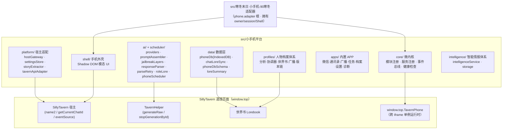
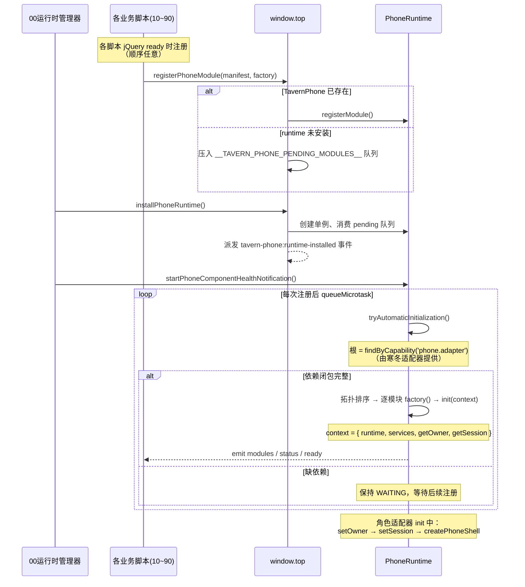

# 01 架构总览

## 1. 系统定位与运行环境

小手机平台运行在 **SillyTavern（酒馆）** 页面中，以 **酒馆助手（Tavern Helper）脚本** 的形式存在。每个脚本是一个独立的 iframe，运行在酒馆后台，没有自己的页面。

由此带来两个关键环境约束，整个架构都围绕它们设计：

1. **多脚本、多 iframe、加载顺序不确定**：平台的 9 个入口脚本（`脚本/00` ~ `脚本/90`）是互相独立的酒馆助手脚本，可按任意顺序加载。跨 iframe 协作必须经由顶层窗口 `window.top`。
2. **跨域不可达即失败**：`window.top` 探测跨域失败时直接抛错，禁止 iframe 本地降级（保证不会出现多个割裂的运行时实例）。

平台对外提供的玩法能力：

- iOS 风格手机外壳（Shadow DOM 模态 UI），挂载在酒馆顶层页面
- 微信模拟（私聊 / 群聊 / 公共广播），AI 驱动 NPC 回复
- 动态人物档案（AI 增量分析、世界书持久化、版本链）
- 末日公共广播（profile-radio 三栏新闻）
- 智能任务 / 智能档案（intelligence 简化路线）
- 与主聊天联动（剧情正文抽取、输入框回填、世界书回注）

## 2. 设计理念

| 理念 | 落地方式 |
| --- | --- |
| **微内核 + 插件式模块** | `core/` 提供运行时（模块注册表、服务注册表、事件总线），业务全部以 `PhoneModule` 形式接入，按 `dependsOn` 拓扑排序初始化 |
| **顺序无关注册** | 脚本加载时若 runtime 未就绪，注册请求进入 `window.top.__TAVERN_PHONE_PENDING_MODULES__` 暂存队列，runtime 安装后统一消费 |
| **服务发现（capability）** | 模块在 `init` 时按 capability 字符串（如 `'phone.db'`、`'ai.providers'`）发布服务，消费方 `require` 获取，源码级零直接依赖 |
| **会话隔离** | 全平台数据以 `sessionKey = ${characterName}::${chatId}` 为隔离键（IndexedDB 复合主键、世界书、设置、档案均如此） |
| **依赖注入、可测试** | db / writer / storage / fetch / scheduler 全部参数注入，测试可脱离酒馆环境运行（fake-indexeddb、mock 全局函数） |
| **安全防线** | API Key 不落地（`withApiKey` 回调瞬态取用 + 双重 `containsApiKey` 扫描）；UI 全部 `textContent`（禁 innerHTML）；提示词注入防护（动态内容 JSON 单行化 + 只读声明）；解析防原型污染 |
| **事实一致性** | 提示词快照深冻结（`structuredClone` + `Object.freeze`），生成期间事实不漂移 |

## 3. 分层架构



分层职责一句话总结：

- **core/**：不关心任何业务，只管「模块如何注册、排序、初始化、卸载」与「服务如何发布、发现」。
- **platform/**：把酒馆差异（宿主事件、生成 API、楼层读取、localStorage）收敛为可注入的纯能力。
- **data/**：手机数据持久化（IndexedDB 为主）与世界书增量回注。
- **ai/ + scheduler/**：无状态 AI 能力层 + 通用受控调度器，酒馆 API 在装配层注入。
- **shell/ + apps/**：纯 UI 层，通过 `PhoneAppServices` 接口与业务解耦。
- **profiles/ + intelligence/**：两条并行的业务路线（前者完整、后者简化）。
- **脚本/00~90**：把上述能力包装为模块入口，注册进运行时。

## 4. 核心概念

| 概念 | 定义 | 出处 |
| --- | --- | --- |
| **PhoneRuntime（TavernPhone）** | 挂在 `window.top.TavernPhone` 的运行时单例，负责模块生命周期、owner/session 管理、事件分发 | [core/runtime.ts](../core/runtime.ts) |
| **PhoneModule** | 平台模块实例契约：`init(context)` / `dispose(reason)` / `getStatus()` | [core/types.ts](../core/types.ts) |
| **PhoneModuleManifest** | 模块描述符：`{ id, version, required, dependsOn, capabilities }` | [core/types.ts](../core/types.ts) |
| **capability** | 服务注册表中的字符串键，如 `'phone.db'`、`'phone.shell'`；`'phone.adapter'` 是自动初始化的根标记 | [core/serviceRegistry.ts](../core/serviceRegistry.ts) |
| **PhoneOwner / PhoneSession** | 手机归属者（角色卡+适配器）与会话快照（角色 × 聊天） | [core/types.ts](../core/types.ts) |
| **sessionKey** | `${characterName}::${chatId}`，全平台数据隔离键 | [core/runtime.ts](../core/runtime.ts) `makeSessionKey` |
| **PhoneHostBridge** | 与同层前置（same-layer-pre）脚本通信的宿主桥，用于取剧情楼层号、回填输入框 | [core/types.ts](../core/types.ts) |
| **PhoneShell** | Shadow DOM 手机外壳实例，一个运行时同一时刻仅允许一个 | [shell/phoneShell.ts](../shell/phoneShell.ts) |

## 5. 模块初始化时序



要点：

1. **自动初始化以 `phone.adapter` capability 为根**，只初始化根的依赖闭包；不在闭包内的模块（如 `main.adapter`）保持 `REGISTERED`（standby 待命）。
2. **初始化失败会回滚**：半初始化实例与已初始化模块逆序 dispose，之后允许重试。
3. **owner 冲突保护**：不同角色卡抢占 runtime 时 `setOwner` 抛错；session 变化会使宿主桥失效，防止串卡/串聊天。

## 6. 源码目录结构

```
src/小手机平台/
├── core/
│   ├── types.ts              # 全平台类型契约（模块/服务/运行时/事件）
│   ├── eventBus.ts           # 泛型事件总线（监听器异常隔离）
│   ├── serviceRegistry.ts    # capability 键控服务注册表
│   ├── serviceModule.ts      # {capability: service} → PhoneModule 工厂
│   ├── moduleRegistry.ts     # 模块注册表 + 拓扑排序 + 初始化/回滚
│   ├── register.ts           # 跨 iframe 注册入口（pending 队列）
│   ├── runtime.ts            # PhoneRuntime 微内核 + top 单例安装
│   └── componentHealth.ts    # 10 组件期望清单 + 健康报告 + toastr 通知
├── platform/
│   ├── hostGateway.ts        # window.top.SillyTavern 宿主网关（会话快照）
│   ├── settingsStore.ts      # localStorage 设置仓库（公开/密钥分离）
│   ├── storyExtractor.ts     # 主聊天楼层正文抽取
│   └── tavernApiAdapter.ts   # TavernHelper.generateRaw 适配
├── data/
│   ├── phoneDb.ts            # IndexedDB「tavern-phone」库 + 内存实现
│   ├── phoneDbSchema.ts      # 导入/导出包 zod 校验（宽容解析）
│   ├── chatLoreSync.ts       # 消息→世界书增量同步器（防抖+串行队列）
│   └── loreSummary.ts        # 世界书条目摘要文本生成（限长）
├── ai/
│   ├── providers.ts          # TavernProvider / OpenAICompatibleProvider
│   ├── promptAssembler.ts    # 六段式提示词组装 + 预算裁剪
│   ├── jailbreakLayers.ts    # 破限三层 + 角色消息序列构造
│   ├── responseParser.ts    # {messages:[{sender,content}]} 解析管线
│   ├── parseRetry.ts         # 解析失败重试回路
│   └── roleLore.ts           # 世界书条目按角色归组
├── scheduler/
│   └── phoneScheduler.ts     # ControlledPhoneScheduler 受控调度器
├── shell/
│   ├── phoneShell.ts         # Shadow DOM 手机外壳（路由栈/焦点陷阱）
│   └── phoneShell.css        # iOS 风格完整样式（含微信视觉）
├── apps/
│   ├── phoneApps.ts          # 8 个内置 APP 定义与全部页面渲染
│   ├── profileHelper.ts      # 无档案服务时的兜底收集器
│   ├── profileAnalyzer.ts   # 独立"房东卡"风格档案分析器（旧全局桥接）
│   └── intelligentApps.ts    # 智能档案/智能任务 APP（intelligence UI）
├── profiles/
│   ├── profileTypes.ts       # 档案体系全部类型
│   ├── profileSources.ts     # 证据源增量选择 + 正文指纹计数
│   ├── profileAnalysis.ts    # zod 契约/系统提示词/文档合并/条目渲染
│   ├── profileWorldbook.ts   # 动态档案世界书写入（content+extra 双写）
│   ├── profileRefreshCoordinator.ts  # 刷新流水线编排（体系心脏）
│   ├── profileBroadcast.ts   # 末日公共广播（三栏新闻，隐私过滤）
│   └── profileMacro.ts       # {{TAVERN_PHONE_PROFILE}} 提示词宏
├── intelligence/
│   ├── profileTypes.ts       # PersonProfile/SmartTask + 提示词模板
│   ├── intelligenceService.ts# 档案增强/任务解析两条 AI 流
│   ├── storage.ts            # Memory/PhoneDb 双存储实现
│   ├── integration.example.ts# 集成示例
│   └── README.md             # 使用指南
├── assets/
│   └── wechatIcon.ts          # 微信图标（base64 PNG）
├── 脚本/
│   ├── 00运行时管理器/index.ts  # 安装 runtime + 健康通知
│   ├── 10平台服务/index.ts      # platform.services 模块
│   ├── 20数据与同步/index.ts     # data.sync 模块
│   ├── 30AI与调度/index.ts       # ai.scheduler 模块
│   ├── 40手机外壳/index.ts       # phone.shell 模块
│   ├── 50通信与情报APP/index.ts  # communication.apps 模块
│   ├── 60智能情报/index.ts       # intelligence.services 模块（可选）
│   ├── 70微信APP适配器/index.ts  # wechat.adapter 模块
│   └── 90主适配器/index.ts       # main.adapter 实验性通用适配器
└── __tests__/                 # 自包含 Node 测试（详见 09 文档）
```

## 7. 与外部系统的关系（概要）

| 外部系统 | 关系 | 详见 |
| --- | --- | --- |
| 酒馆助手（Tavern Helper） | `getChatMessages` 读楼层；`window.parent.TavernHelper.generateRaw / stopGenerationById` 走 AI 生成；jQuery / toastr 全局 | [08](08-依赖关系与外部集成.md) |
| SillyTavern 宿主 | `window.top.SillyTavern`（`name2` / `getCurrentChatId` / `eventSource` / `eventTypes`）；`window.top.document` 挂载外壳 | [03](03-数据层与平台适配.md) |
| 旧版小手机（`src/小手机`） | `70微信APP适配器` 的 `message.sender` 服务桥接旧版全局对象（`ChatDB` / `ChatCore` / `ChatSync`） | [08](08-依赖关系与外部集成.md) |
| 寒冬末日适配器（`src/寒冬末日/脚本/小手机-90寒冬适配器`） | **反向依赖本平台**：声明 `phone.adapter` 根 capability，负责 `setOwner` / `setSession` / 创建唯一 Shell，是当前唯一真实角色适配器 | [07](07-脚本入口与模块注册.md) |
