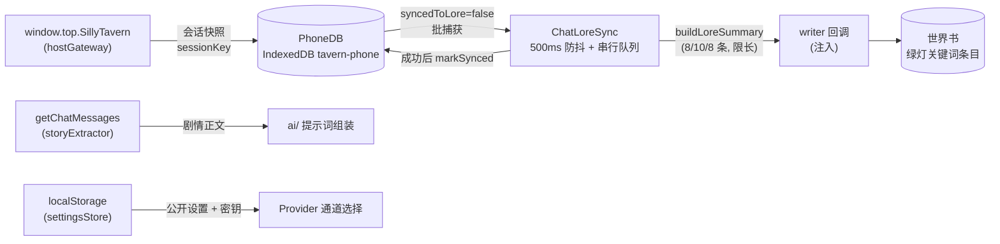

# 03 数据层与平台适配（data/ + platform/）

本章覆盖两组模块：

- **platform/** - 宿主适配层：把 SillyTavern / 酒馆助手的差异收敛为可注入的纯能力（宿主网关、设置存储、剧情抽取、生成 API 适配）
- **data/** - 数据层：手机数据持久化（IndexedDB）与世界书增量回注

设计特点：**全部依赖注入**（db / writer / storage / 全局函数都是参数），因此可脱离酒馆环境单测。

---

## 3.1 [platform/hostGateway.ts](../platform/hostGateway.ts) - 酒馆宿主上下文网关

从 SillyTavern 顶层窗口读取角色名/聊天 ID，监听宿主事件，广播「会话上下文快照」。

| 导出 | 说明 |
| --- | --- |
| `HostContextSnapshot` | `{ characterName, chatId, sessionKey }`，其中 `sessionKey = ${characterName}::${chatId}`（**PhoneDB 全部数据的隔离键**） |
| `PublicHostApi` | 宿主最小接口：`{ name2, getCurrentChatId(), eventTypes: {CHAT_CHANGED, CHARACTER_PAGE_LOADED}, eventSource: {on, removeListener} }` |
| `createHostGateway(host, options?)` | 结构校验后读取初始快照；订阅 `CHAT_CHANGED` + `CHARACTER_PAGE_LOADED`（任一订阅失败回滚全部已挂监听并抛 `AggregateError`）；事件触发时重读快照，characterName/chatId 均未变则不通知；`dispose()` 移除全部监听 |
| `createTopHostGateway(options?)` | 从 `window.top` 取宿主：优先 `topWindow.SillyTavern.getContext()`，否则直接用 `SillyTavern` 对象本身 |

> `sessionKey` 的变更会驱动整个平台切换数据视图：DB 记录、世界书同步、档案状态均按新键隔离。

## 3.2 [platform/settingsStore.ts](../platform/settingsStore.ts) - 平台设置存储

基于注入的 `StorageLike`（实际为 localStorage）实现「公开设置 + 密钥分离」的设置仓库。

| 导出 | 说明 |
| --- | --- |
| `PublicSettings` | `{ provider: 'tavern'\|'openai-compatible', apiUrl, model, parameters, theme, notifications }`（深冻结） |
| `StorageLike` | `{ getItem, setItem, removeItem }` localStorage 最小抽象 |
| `createSettingsStore(characterName, storage, options?)` | 返回 `SettingsStore` |

`SettingsStore` 方法：

- `getPublic()` / `updatePublic(patch)`（校验 + 变更检测 + 持久化 + 通知订阅者）
- `subscribe(listener)`
- `setSecret(apiKey)` / `clearSecret()` / `withApiKey(cb)` - **密钥按需读取，不进入公开状态**

存储键名（命名空间 `tavern-phone:local`）：

| 键 | 用途 |
| --- | --- |
| `tavern-phone:local:public` | 公开设置 |
| `tavern-phone:local:secret` | API 密钥 |
| `tavern-phone:<encodeURIComponent(角色名)>:public/secret` | 旧版键（创建时自动迁移） |

安全校验：`normalizeApiUrl` 只允许绝对 http/https URL；`normalizeParameters` 递归拒绝非有限数字、非 plain object、以及键名匹配 `api[_-]?key|x-api-key|authorization|access-token|bearer-token|token|password|secret` 的凭证字段；读取失败回退默认值（`provider='tavern'`）。

## 3.3 [platform/storyExtractor.ts](../platform/storyExtractor.ts) - 主聊天剧情正文抽取

从酒馆聊天楼层中抽取正文，供 AI 生成与档案分析使用。依赖全局函数 `getChatMessages`（酒馆助手接口）。所有函数对 null/负数/非安全整数楼层号返回空值，读取异常 console.warn 并返回空（非酒馆环境安全降级）。

| 函数 | 签名 | 行为 |
| --- | --- | --- |
| `stripMainChatControlBlocks` | `(content) => string` | 正则剥除 `<UpdateVariable>` / `<Analysis>` / `<JSONPatch>` 标签块（含未闭合残留） |
| `extractRecentCompletedStory` | `({storyMessageId, maxStoryCount=5, markAllRelevant=true}) => PromptSourceEntry[]` | 取当前楼层**之前**最近 N 条 assistant 消息（unhidden、不含 swipes） |
| `extractRecentMainChatMessages` | `(storyMessageId, limit=5) => PromptMainChatEntry[]` | 取最后 5 条 user+assistant 可见消息，**剥离控制块** |
| `extractRecentCompletedMessages` | `(storyMessageId, limit=20) => ProfileStoryMessage[]` | 最近 20 条 user+assistant 非隐藏消息（供档案分析） |
| `extractCurrentStory` | `(storyMessageId) => string` | 当前楼层 assistant 正文（隐藏楼层也能取） |

楼层号来源：`PhoneHostBridge.getStoryMessageId()`（同层前置桥接）。示例见 [storyExtractor.example.md](../platform/storyExtractor.example.md)。

## 3.4 [platform/tavernApiAdapter.ts](../platform/tavernApiAdapter.ts) - 酒馆生成接口适配

| 导出 | 说明 |
| --- | --- |
| `createGenerateRaw()` | 每次调用时从 `window.parent -> window.top -> window` 依次探测 `TavernHelper.generateRaw`；找不到抛错；返回非 string 抛类型错误 |
| `createStopGenerationById()` | 同样探测 `TavernHelper.stopGenerationById`，失败仅 console.warn 不抛 |
| `TavernGenerateOptions` | `{ generation_id, should_stream: false, should_silence: true, max_chat_history: 0, ordered_prompts: [{role, content}] }` |

> `max_chat_history: 0` + `ordered_prompts` 意味着**完全绕过酒馆聊天历史注入**，所有上下文由平台显式提供；`should_silence: true` 抑制酒馆界面输出。

---

## 3.5 [data/phoneDb.ts](../data/phoneDb.ts) - 手机数据库（IndexedDB + 内存双实现）

定义存储抽象 `PhoneDb`，覆盖消息与业务记录的增删查、身份迁移、单会话导出/导入。

### 数据库结构

- 库名 `tavern-phone`，版本 `DATABASE_VERSION = 3`
- **11 个 object store**：`messages` + 10 个业务 store（`PHONE_BUSINESS_STORES`）：`conversations, contactPrefs, inbox, proactiveJobs, profileSettings, storyRefresh, profileAnalysis, profileViews, profileRuns, broadcastIssues`
- 全部 `keyPath: ['sessionKey', 'id']`（复合主键，**天然按会话隔离**）；v3 起 `messages` 增加 `by_session` 索引（`listMessages` 走索引避免全表扫描）
- 安全约束：所有写入前用 `containsApiKey` 递归扫描键名（`/^api[_-]?key$/i` 等），**拒绝存储 API key**

### 关键类型

| 导出 | 说明 |
| --- | --- |
| `PhoneMessageType` | `'private' \| 'group' \| 'broadcast'` |
| `PhoneMessageInput` / `PhoneMessage` | 消息字段：`id, sessionKey, conversationId, type, sender, content, createdAt` + group 专属 `groupName/participants`、broadcast 专属 `source/trust`、`gameDate/gameTime`；`PhoneMessage` 额外含 `syncedToLore`（是否已写入世界书） |
| `PhoneBusinessRecord` | `{ id, sessionKey, [key: string]: unknown }`，其余字段各 store 自定义 |
| `createMemoryPhoneDb()` | 内存 Map 实现（key 为 `sessionKey\u0000id`，读写 clone 隔离），测试用 |
| `createIndexedDbPhoneDb(factory?)` | 异步工厂，无 `indexedDB` 时抛错 |

### PhoneDb 接口方法

| 方法 | 行为 |
| --- | --- |
| `addMessage(input)` | 校验（validateMessage）后写入 messages store |
| `addMessageWithInbox(input, inbox)` | **原子写**：消息与 inbox 记录（status 必须 `pending` 且键一致）写入同一事务 |
| `listMessages(query)` | 按 session/type/conversationId/syncedToLore/时间过滤，createdAt 升序 |
| `markSynced(sessionKey, messageIds)` | 批量置 `syncedToLore: true`（不跨 session 误标） |
| `putRecord / listRecords` | 业务记录读写 |
| `migrateIdentities(sessionKey, migrations)` | 身份迁移（如 `temporary:工程师 -> main:工程师`），单事务覆盖 6 个 store，替换 `private:xxx` 前缀的 conversationId/participants/personId |
| `exportSession / importSession` | 单会话全量导出/导入（zod 校验，坏条目跳过，按 id 覆盖幂等） |

## 3.6 [data/phoneDbSchema.ts](../data/phoneDbSchema.ts) - 导出包 zod 校验

导入侧宽容（剥离未知键 + 跳过坏条目），结构校验从严：

| 导出 | 说明 |
| --- | --- |
| `PHONE_EXPORT_VERSION = 1` | 导出包版本 |
| `phoneMessageSchema` | 字段规则与 `validateMessage` 一致（group/broadcast 条件规则），解析时剥离未知键 |
| `phoneExportBundleSchema` | `{ version, kind: 'phone-session-export', exportedAt, sessionKey, messages, records }` |
| `parsePhoneExportBundle(input)` | 结构性错误整体抛错；单条坏数据、sessionKey 不一致、**原始输入含 API key**（zod 剥离前检查 raw）跳过并记入 `skipped` |
| `buildPhoneExportBundle(input)` | 组装导出包（structuredClone + exportedAt） |
| `containsApiKey(value)` | 递归密钥扫描（独立导出供导入路径复用） |

## 3.7 [data/chatLoreSync.ts](../data/chatLoreSync.ts) - 聊天记录到世界书的同步器

把 PhoneDB 中未同步的消息以摘要形式写入世界书。**不直接调用酒馆世界书 API**——`writer(worldbookName, entry)` 是注入回调（实际实现见 [apps/profileAnalyzer.ts](../apps/profileAnalyzer.ts) 与寒冬适配器）。

| 导出 | 说明 |
| --- | --- |
| `LORE_ENTRY_DEFINITIONS` | 静态条目定义表（广播条目 `[微信-广播]情报摘要`）；私聊/群聊条目按请求动态生成 |
| `DEFAULT_GROUP_NAME = '伊甸住户群'` | 适配器未提供 groupName 时的兜底 |
| `loreEntryNameFor(type, conversationId?, groupName?)` | 条目名：私聊 `[微信-私聊]${剥掉 private: 前缀的身份}`、群聊 `[微信-群聊]${群名}` |
| `class ChatLoreSync` | 见下 |

世界书条目写入规格：

- 触发策略一律**绿灯（selective）按关键词触发**（避免无关楼层持续占用上下文）：广播 `['广播','情报','微信','手机']`；私聊 `[完整身份, 人物名, '微信', '手机']`；群聊 `[群名, '微信', '手机']`
- `position: { type: 'at_depth', role: 'system', depth: 4, order: 100 }`，`probability: 100`

`ChatLoreSync` 方法与内部流程：

| 方法 | 行为 |
| --- | --- |
| `schedule(request)` | 按 `sessionKey\u0000type\u0000conversationId` 分槽 **500ms 防抖**（不同人物私聊各自独立槽位） |
| `flushNow(request)` | 立即执行（捕获请求参数后执行，会话切换中途不串数据） |
| `cancelSession(sessionKey)` | 取消该会话全部待执行 timer |
| `whenIdle()` / `dispose()` | 等待/终止全部工作（幂等、失败聚合） |

同步流水线（模块级 `sharedWorldbookQueue` **串行写队列**）：

1. `captureBatch`：查询该会话/类型/会话的**全部**消息，取 `syncedToLore === false` 的 id 列表（批捕获——写入期间新增的消息属于下一批）
2. `definitionFor` 生成条目定义 -> `buildLoreSummary` 生成摘要文本
3. `writer(worldbookName, {...definition, content})` 写世界书
4. 成功后 `db.markSynced` 标记本批；**writer 抛错则该批不标记（下次可重试）**

## 3.8 [data/loreSummary.ts](../data/loreSummary.ts) - 世界书摘要文本生成

`buildLoreSummary({ type, messages, conversationId? })`：

| 类型 | 条数 | 格式 |
| --- | --- | --- |
| private | 最近 8 条（全 session 该类型） | `【微信私聊】\n[游戏日期 时间]发送者: 内容` |
| group | 最近 10 条（按 conversationId 过滤） | `【微信群聊】群名（参与者：...）` |
| broadcast | 最近 8 条（须有 source 且 trust 为 confirmed/unverified） | `【微信广播】\n[trust][source] ...` |

常量：`CONTENT_LIMIT = 80`（单条截断）、`ENTRY_LIMIT = 800`（整条目上限，超限保留首尾各 200 字符 + `…[中间省略]…`）。

---

## 3.9 脚本入口

### [脚本/10平台服务](../脚本/10平台服务/index.ts) - 模块 `platform.services`

manifest：`{ id: 'platform.services', version: '1.0.1', required: true, dependsOn: [] }`，jQuery ready 时 `registerPhoneModule` 注册。

| 发布 capability | 服务对象 |
| --- | --- |
| `host.gateway` | `{ createTopHostGateway }` |
| `settings.store` | `{ createSettingsStore }` |
| `story.extractor` | `{ extractRecentCompletedStory, extractCurrentStory }` |

### [脚本/20数据与同步](../脚本/20数据与同步/index.ts) - 模块 `data.sync`

manifest：`{ id: 'data.sync', version: '1.0.0', required: true, dependsOn: ['platform.services'] }`。

| 发布 capability | 服务对象 |
| --- | --- |
| `phone.db` | `{ createIndexedDbPhoneDb, createMemoryPhoneDb, PHONE_EXPORT_VERSION }` |
| `chat-lore.sync` | `{ ChatLoreSync, LORE_ENTRY_DEFINITIONS, buildLoreSummary }` |

> 依赖声明保证宿主网关（sessionKey 来源）先于数据层初始化。

---

## 3.10 数据流转总览

要点：

1. **持久化分工**：IndexedDB 存消息与业务记录（会话隔离）；localStorage 存设置与密钥（公开/密钥分离）；世界书存「回注主聊天上下文」的增量摘要。
2. **`syncedToLore` 是世界书与 DB 之间的增量游标**：写入失败不标记保证可重试；批捕获保证写入期间的新消息留给下一批。
3. **测试参考**：[__tests__/data.test.ts](../__tests__/data.test.ts)（约 1160 行）覆盖双实现的全部行为；[__tests__/storyExtractor.test.ts](../__tests__/storyExtractor.test.ts) mock 全局 `getChatMessages`。
