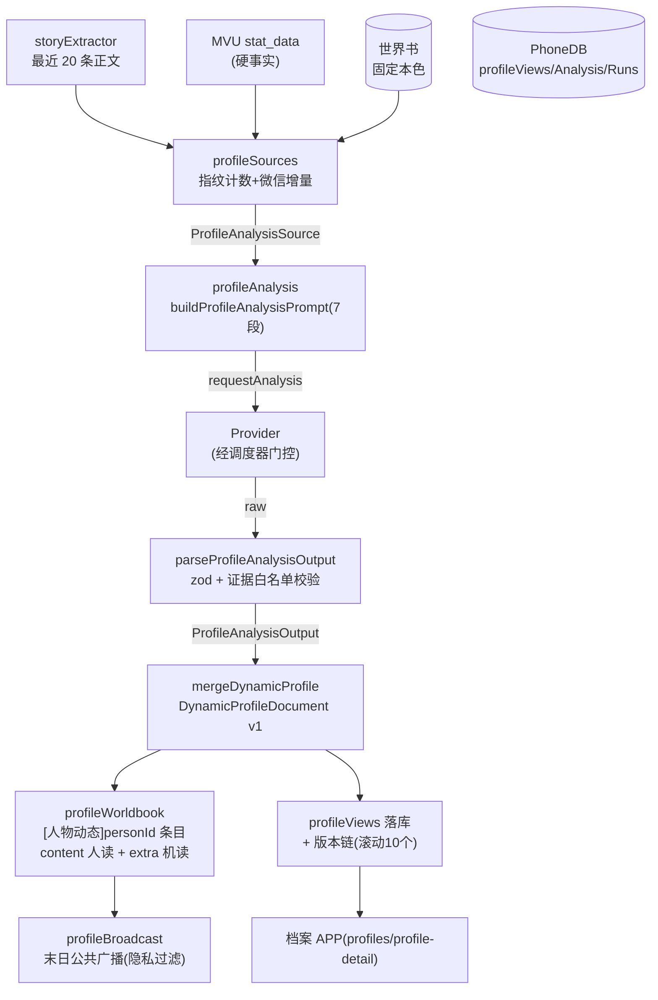

# 06 人物档案与智能情报（profiles/ + intelligence/）

平台包含**两条并行的人物情报路线**：

| | profiles/（动态人物档案体系） | intelligence/（智能情报体系） |
| --- | --- | --- |
| 定位 | 完整路线：AI 增量分析 + 世界书持久化 + 版本链 + 广播 | 简化路线（参考「房东模拟器 Z5.20」）：档案增强 + 任务解析 |
| 存储 | PhoneDB 5 个业务 store + 世界书双写 | Memory / PhoneDB 双实现 |
| 触发 | 正文指纹计数达阈值自动 / 手动 / 重试，经调度器受控 | 手动 / 聊天解析 |
| UI | `phoneApps.ts` 的 profiles / profile-detail / broadcasts | `intelligentApps.ts` 的 profiles / smart-tasks |
| 依赖关系 | 与 intelligence 完全互不依赖 | 同左 |

---

# A. 动态人物档案体系（profiles/）

## A.1 数据流全景

## A.2 [profiles/profileTypes.ts](../profiles/profileTypes.ts) - 核心类型

| 类型 | 说明 |
| --- | --- |
| `ProfileEvidenceRef` | 证据引用：`'fixed-profile' \| 'previous-dynamic' \| 'mvu:${key}' \| 'story:${id}' \| 'wechat:${id}'` |
| `ProfileAnalysisSource` | 分析输入：`sessionKey / personId / personName / fixedProfile（固定本色）/ mvuFacts（MVU 硬事实）/ story（最近正文）/ wechatContext（锚点上下文）/ wechatNew（新增微信）/ previous（上次动态档案）` |
| `ProfileAnalysisOutput` | AI 结构化输出：`analysisNarrative / changes / basicInfoAdditions / 9 个动态字段 / evidenceRefs` |
| `DynamicProfileDocument` | **version: 1 动态档案文档**：`fixedBaseline / hardFacts（MVU 冻结副本）/ basicInfoAdditions / 9 个动态字段 / lastWechatRound / evidenceRefs / updatedAt` |
| `ProfileViewRecordData` | 视图记录：document + playerActionAdvice + 分析叙事 + changes + rawResponse? + versions |
| `ProfileEditPatch` | 玩家编辑补丁（10 个可选字段） |
| `ProfileAnalysisState` | 每人状态：`lastWechatMessageId`（**微信增量锚点**）/ status / lastError / lastFallbackReason / lastRawResponse / lastReasoningContent |
| `ProfileVersion` | 历史版本：id（`profile-version:${savedAt}:${personId}`）、source `'ai'\|'player'\|'restore'`、document 快照等 |
| `ProfileStateEvent` | `{personId, status, lastError?}` 状态广播事件 |

9 个动态字段：`behaviorTuning / personalityTuning / speechStyleTuning / currentGoals / currentSituationSummary / relationshipInterpretation / storyInteractionSummary / chatInteractionSummary / playerActionAdvice`。

## A.3 [profiles/profileSources.ts](../profiles/profileSources.ts) - 证据源增量选择与正文计数

| 导出 | 行为 |
| --- | --- |
| `reconcileStoryCounter(previous, current)` | 对每条正文消息计算 **FNV-1a 指纹**；未提交过的进 pending；已提交但内容变化进 changed |
| `commitStoryCounter(state)` | pending 合并进 committed（**只保留最近 200 条指纹**），count 清零 -- 已提交正文不会重复触发 |
| `selectWechatIncrement(messages, anchorId, firstWindow=20, contextCount=4)` | 无锚点或锚点消息已不存在时取最近 20 条（`fallbackReason: 'first-analysis' / 'anchor-missing'`）；正常时返回锚点前 4 条上下文 + 锚点之后全部新消息 -- **增量消费语义** |

## A.4 [profiles/profileAnalysis.ts](../profiles/profileAnalysis.ts) - 分析核心（纯函数）

| 导出 | 行为 |
| --- | --- |
| `ProfileAnalysisOutputSchema` | zod strict：`analysisNarrative ≤2000`、`changes ≤12 项（before/after ≤1200）`、`basicInfoAdditions ≤8 条`、动态字段限长、`evidenceRefs 1-32 条`（正则白名单） |
| `PROFILE_ANALYSIS_SYSTEM_PROMPT` | 角色动态分析专家；**事实优先级：MVU 硬事实 > 最近正文明确事实 > 固定角色世界书 > 当前人物微信 > 上一次动态档案**；只输出 JSON |
| `parseProfileAnalysisOutput(raw, source?)` | 解析（裸 JSON / 围栏 / jsonrepair / 三种包壳）-> zod 校验 -> 若给 source 再校验**人物身份一致** + **证据引用必须在白名单**（引用不存在的证据直接抛错） |
| `buildProfileAnalysisPrompt(source)` | 7 段式：分析对象/检查重点/约束 +【1】MVU 硬事实 +【2】固定世界书 +【3】最近 20 条正文 +【4】微信（context+newlyAdded）+【5】上次动态档案（全部经 `readonlyData()` 包装防注入）+【6】证据标记 +【7】输出 JSON 契约 |
| `mergeDynamicProfile(source, output, lastWechatRound, now)` | 合成 `DynamicProfileDocument`（关键子结构 `Object.freeze`） |
| `renderPromptProfile(document, maxCharacters=2000)` | **世界书条目正文渲染器**：不可变段（身份/固定本色/MVU 硬事实/**私密范围声明**「仅该人物可将本条目的私聊信息作为认知依据」）超限直接抛错；动态段在剩余预算内逐条截断追加 |
| `buildProfileViewRecord(source, output, document)` | 合成视图记录 |

## A.5 [profiles/profileWorldbook.ts](../profiles/profileWorldbook.ts) - 动态档案世界书写入

| 导出 | 行为 |
| --- | --- |
| `dynamicProfileEntryName(personId)` | `'[人物动态]' + personId` |
| `buildDynamicProfileEntry(document, aliases, maxCharacters)` | keys = `[personName, ...aliases]` 去重（空则抛错）；`content = renderPromptProfile(...)`；**`extra.dynamicProfileDocument` 存完整文档结构化副本**（`tavernPhoneKind:'dynamic-profile'`、`schemaVersion:1`）-- 双写：人读 content，机读 extra |
| `readDynamicProfileEntry(personId, entries)` | 按条目名找到后校验 `extra.dynamicProfileDocument`（version===1 且 personId 匹配） |
| `writeDynamicProfileEntry(worldbookName, document, aliases, maxCharacters, writer)` | `writer.assertSession()` -> build -> `writer.update` 中同名替换（**保留原 uid**）或追加 -> 再次 assertSession（写入期间会话切换即抛错） |

条目策略：selective 绿灯（keys 为人物名/别名）、`before_character_definition` / role system / depth / order。

## A.6 [profiles/profileRefreshCoordinator.ts](../profiles/profileRefreshCoordinator.ts) - 刷新协调器（体系心脏）

编排完整刷新流水线。依赖注入：`db / scheduler / now() / getSessionKey() / getSnapshotKey() / getStoryMessages() / listAddedPeople() / collectSource / requestAnalysis / writeWorldbook / onAllRunComplete?`。

设置：`ProfileRefreshSettings = { autoRefreshEvery（默认 20）, promptProfileMaxChars（默认 2000） }`，`validateSettings` 限制阈值 1-50。

### 核心方法

| 方法 | 行为 |
| --- | --- |
| `getSettings / saveSettings` | 读写 `profileSettings` store |
| `getStoryProgress` / `reconcileStory(storyMessages?)` | 读/校正 `storyRefresh` 计数；达阈值 `refreshAll('auto')` 后 `commitStoryCounter`（**已提交正文不会重复触发**） |
| `watchProfiles(listener)` | 状态监听（返回退订函数）；UI 监听器抛错不影响持久化 |
| `recoverInterruptedAnalyses()` | 启动恢复：refreshing 状态一律改判 failed（「上次档案分析因页面刷新或脚本重载中断，请重新分析」） |
| `listProfiles / getProfileView(personId)` | 读 `profileViews` store，`structuredClone` 防内部状态泄漏 |
| `saveProfileEdit(personId, patch)` | 合成新 document -> `writeWorldbook` -> `makeVersion('player')` -> 写回（**versions 滚动保留最近 10 个**） |
| `restoreProfileVersion(personId, versionId)` | 目标版本 document 克隆 -> 写世界书 -> `makeVersion('restore')` -> 写回（还原叙事/变化/建议） |
| `refreshPerson / refreshAll / retryFailed` | 经 `batchTail` Promise 链**排队串行**执行（前一任务失败不阻断后续） |
| `dispatchScheduledRefresh(job)` | 调度器回调入口，校验 `job.source === 'profile_refresh'` |

### 单人物刷新流水线（refreshScheduledPerson）

①状态置 refreshing + notify -> ②`collectSource` 收集证据 -> ③构建提示词 -> ④`requestAnalysis`（字符串或 `AiDetailedResponse`）-> ⑤解析校验（失败把原始响应挂到 error 以便回写）-> ⑥`mergeDynamicProfile` -> ⑦`writeWorldbook` -> ⑧构建视图 + `makeVersion('ai')` 写 view（rawResponse/reasoningContent 一并落库）-> ⑨状态 success + **更新微信锚点** -> ⑩更新 run 记录。

失败路径：状态 failed + lastError + notify + rethrow。**世界书写入失败不推进微信锚点**（保证下次重试时证据不丢）。

批次语义：`runBatch` 批内**逐人串行**（一人失败继续下一人）；`auto/all-manual` 且至少一人成功时调 `onAllRunComplete`（挂接广播生成）；AI 等待期间会话切换则抛「档案刷新已因会话切换失效」。

使用 5 个 db store：`profileSettings / profileAnalysis / profileRuns / profileViews / storyRefresh`。

## A.7 [profiles/profileBroadcast.ts](../profiles/profileBroadcast.ts) - 末日公共广播

把**公开证据**生成三栏新闻，存入 `broadcastIssues` store。

| 导出 | 行为 |
| --- | --- |
| `PROFILE_BROADCAST_TITLES` | `['本台通告','生活频道','街坊风声']`（固定三段节目顺序；三段各用一种声音：管理处官方腔 / 物资组熟人口吻 / 八卦邻居口吻） |
| `PROFILE_BROADCAST_SYSTEM_PROMPT` | 广播站制作人兼轮值播音员人设：三声腔、分段长度（通告/生活 60~200 字，「街坊风声」传闻叙事放宽到 60~300 字）、**感知化改写**（把 MVU 数据翻译成住户可感知的事件）、活人感（信源模糊化 + 允许补楼内议论但不虚构事实）、钩子（传闻/反常细节/下期预告）、严禁编造/续写剧情/下达行动、严禁引用私聊、仅当某段确实无话可说才写「暂无重大变化」、只输出 JSON |
| `buildProfileBroadcastPrompt(input)` | **先过滤 `publicProfileChanges`** -- 仅保留 evidenceRefs 全部为 `story:`/`mvu:` 前缀的变化（**私聊 wechat 与上次档案 previous-dynamic 的变化被剔除**）；提示词按【本期节目单】（三段声音 + 各自播什么 + 素材映射）->【公开正文】（编号行）->【MVU公开事实】（多行 JSON，由寒冬适配器的 `selectPublicWinterMvuFacts` 做字段级投影）->【人物动向】（编号行）->【输出契约】（通告/生活 60~200 字、「街坊风声」60~300 字节目正文）的结构组装 |
| `parseProfileBroadcastOutput(raw)` | zod strict（三元组 tuple、title 字面量、body 1-1500 字） |
| `saveProfileBroadcastIssue(db, input)` | 组装 `StoredProfileBroadcastIssue`（`kind:'profile-radio'`、sourceStoryCursor、rawText）-> 写 `broadcastIssues` |

隐私约束（测试断言）：本模块**不**调用世界书写入函数，与 ChatLore 存储完全隔离；私聊/上次档案内容不得进入提示词。

## A.8 [profiles/profileMacro.ts](../profiles/profileMacro.ts) - 档案提示词宏

`resolveProfilePromptMacros(template, context)`：本地解析 `{{TAVERN_PHONE_PROFILE(:personId)?}}` 宏（**不注册酒馆全局宏**），显式指定 personId 或回退 `currentPersonId`，调用 `context.read()` 取档案渲染文本，未命中替换为空串。

---

# B. 智能情报体系（intelligence/）

## B.1 [intelligence/profileTypes.ts](../intelligence/profileTypes.ts) - 类型与提示词模板

| 导出 | 说明 |
| --- | --- |
| `PersonProfile` | 简化档案：基本信息/性格/当前状态/关系/最近互动 + `sources: {fromMvu, fromChat, fromBroadcast, fromStory}` 四布尔标记 + lastUpdated |
| `SmartTask` | 任务：title/detail/`type: 'mvu-stage'\|'chat-derived'\|'broadcast-derived'`/source/relatedPersons/actionText?/priority |
| `buildProfileEnhancePrompt(request)` | 多源整合提示词：5 段信息（基本信息/MVU/最近 10 条聊天/最近 5 条广播/正文）-> JSON 输出；强调「信息不足用待了解而非编造」 |
| `buildTaskParsePrompt(request)` | 任务解析提示词：最近 20 条聊天 + 正文 + 现有任务；**5 类识别规则**（明确邀请/约定会面/请求帮助/提及地点/物品交接）；输出 JSON 数组（空则 `[]`） |

## B.2 [intelligence/intelligenceService.ts](../intelligence/intelligenceService.ts) - 智能情报服务

`class IntelligenceService`（`createIntelligenceService(provider)`），`AiProvider` 接口 `request(prompt): RequestHandle<string>`（兼容两 Provider）：

| 方法 | 数据流 |
| --- | --- |
| `enhanceProfile(request)` | 构建提示词 -> 请求 -> `parseJsonResponse`（三级容错：直接 parse -> 围栏提取 -> `{...}`/`[...]` 正则提取）-> 组装结果（空值兜底「待了解」）+ sources 标记 |
| `parseTasks(request)` | 同上 -> 每项映射 `SmartTask`（id: `chat-task-${Date.now()}-${index}`、type 固定 `chat-derived`、priority 缺省 medium）；非数组返回 `[]` |
| `cancel(handle)` / `isProviderError` | 透传取消 / 错误类型守卫 |

## B.3 [intelligence/storage.ts](../intelligence/storage.ts) - 存储

| 实现 | 说明 |
| --- | --- |
| `MemoryProfileStore` / `MemoryTaskStore` | `Map<sessionKey, Map<id, T>>`；任务按 priority（high>medium>low）+ createdAt 倒序；含 `clearSession()` |
| `PhoneDbProfileStore` | 写 `contactPrefs` store（id 前缀 `profile:${personId}`，档案存 `profileData` 字段） |
| `PhoneDbTaskStore` | 写 `proactiveJobs` store（任务存 `taskData` 字段） |

**已知限制**：PhoneDb 实现的 `deleteProfile` / `deleteTask` 直接抛错、`cleanExpiredTasks` 仅 warn（因 PhoneDb 无删除 API）。

## B.4 [intelligence/README.md](../intelligence/README.md)

中文使用指南：快速开始 6 步、核心 API 参考、三个使用场景代码、注意事项（API 成本/数据隐私/任务去重/MemoryStore vs PhoneDbStore 取舍）。集成示例见 [integration.example.ts](../intelligence/integration.example.ts)。

---

## 脚本入口

[脚本/60智能情报](../脚本/60智能情报/index.ts) - 模块 `intelligence.services`（**required: false，可选**）：

manifest：`{ id: 'intelligence.services', version: '1.0.0', dependsOn: ['platform.services', 'data.sync', 'ai.scheduler'] }`。

| 发布 capability | 服务对象 |
| --- | --- |
| `intelligence.service` | `{ createIntelligenceService }` |
| `intelligence.storage` | `{ MemoryProfileStore, MemoryTaskStore, PhoneDbProfileStore, PhoneDbTaskStore }` |

测试参考：[__tests__/profileCoordinator.test.ts](../__tests__/profileCoordinator.test.ts)（全链路：世界书写失败不推进锚点、批次串行、中断恢复、版本链等）、[__tests__/profileBroadcast.test.ts](../__tests__/profileBroadcast.test.ts)（隐私过滤与三栏校验）、[__tests__/intelligenceService.test.ts](../__tests__/intelligenceService.test.ts)、[__tests__/storage.test.ts](../__tests__/storage.test.ts)、[__tests__/profileWorldbook.test.ts](../__tests__/profileWorldbook.test.ts)、[__tests__/profileAnalysis.test.ts](../__tests__/profileAnalysis.test.ts) 等。
