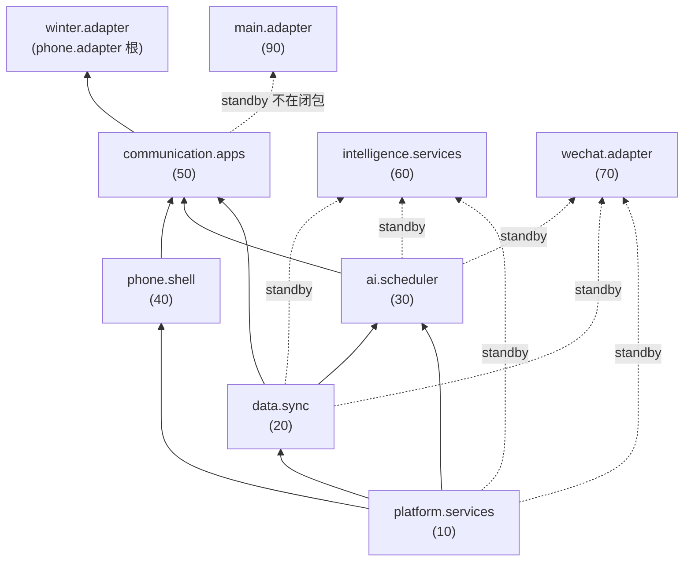

# 07 脚本入口与模块注册

`脚本/` 下每个子目录是一个独立的酒馆助手脚本项目（各含一个 `index.ts`，打包为 `dist/小手机平台/脚本/<名称>/index.js`）。**入口之间没有任何 import 关联**，全部通过运行时服务注册表协作，因此可按任意顺序加载。

## 7.0 总成入口（推荐安装方式）

[总成](../总成/index.ts)（`dist/小手机平台/总成/index.js`，约 236 KiB 单文件）按依赖顺序打包了**必需闭包的全部六个入口**（00运行时管理器 -> 50通信与情报APP）。角色卡只需两条脚本：

```ts
import 'https://testingcf.jsdelivr.net/gh/<user>/<repo>@<tag>/dist/小手机平台/总成/index.js';
import 'https://testingcf.jsdelivr.net/gh/<user>/<repo>@<tag>/dist/寒冬末日/脚本/小手机-90寒冬适配器/index.js';
```

- **版本控制**：发布时更新 `PLATFORM_ASSEMBLY_VERSION`（建议与 git tag 一致）；加载后版本戳写入 `window.top.__TAVERN_PHONE_ASSEMBLY__`，重复安装/混版总成双通道告警（控制台 + toastr）。
- **与散装脚本兼容**：同版本重复注册幂等（注册表按 manifest version 去重），混版本重复注册由注册表抛错拦截。已装散装脚本的卡可平滑迁到总成，反之亦可。
- **不包含**：60智能情报 / 70微信APP适配器 / 90主适配器（standby 可选扩展）与角色专用适配器——后者必须独立安装，负责 owner/session/Shell。

## 7.1 入口总表

| 入口 | 模块 id | 版本 | required | dependsOn | manifest capabilities | 发布的服务 capability | 健康级别 |
| --- | --- | --- | --- | --- | --- | --- | --- |
| [00运行时管理器](../脚本/00运行时管理器/index.ts) | --（不注册模块） | -- | -- | -- | -- | 安装 runtime + 健康通知 | ready |
| [10平台服务](../脚本/10平台服务/index.ts) | `platform.services` | 1.0.1 | true | `[]` | `platform.services` | `host.gateway` / `settings.store` / `story.extractor` | ready |
| [20数据与同步](../脚本/20数据与同步/index.ts) | `data.sync` | 1.0.0 | true | `platform.services` | `data.sync` | `phone.db` / `chat-lore.sync` | ready |
| [30AI与调度](../脚本/30AI与调度/index.ts) | `ai.scheduler` | 1.0.2 | true | `platform.services, data.sync` | `ai.scheduler` | `prompt.assembler` / `ai.providers` / `phone.scheduler` | ready |
| [40手机外壳](../脚本/40手机外壳/index.ts) | `phone.shell` | 1.0.1 | true | `platform.services` | `phone.shell` | `phone.shell` | ready |
| [50通信与情报APP](../脚本/50通信与情报APP/index.ts) | `communication.apps` | 1.0.1 | true | `data.sync, ai.scheduler, phone.shell` | `communication.apps` | `communication.apps` | ready |
| [60智能情报](../脚本/60智能情报/index.ts) | `intelligence.services` | 1.0.0 | **false** | `platform.services, data.sync, ai.scheduler` | `intelligence.services` | `intelligence.service` / `intelligence.storage` | standby |
| [70微信APP适配器](../脚本/70微信APP适配器/index.ts) | `wechat.adapter` | 1.0.0 | true | `platform.services, ai.scheduler, data.sync` | `wechat.adapter` | `provider.factory` / `message.sender` | standby |
| [90主适配器](../脚本/90主适配器/index.ts) | `main.adapter` | 1.0.0 | **false** | `communication.apps` | `main.adapter` | （消费方，PhoneAppServices 桩） | standby |

> 外部根模块：`src/寒冬末日/脚本/小手机-90寒冬适配器` 注册 `winter.adapter`（v1.1.2，dependsOn `communication.apps`，**capabilities 含 `phone.adapter`**，健康级别 ready）。

## 7.2 注册机制

每个入口统一模式（jQuery ready 时执行，保证脚本加载完成）：

```ts
$(() => {
  registerPhoneModule({
    manifest: { id, version, required, dependsOn, capabilities },
    factory: () => createServiceModule(id, { capability: serviceImpl, ... }),
  });
});
```

`registerPhoneModule`（[core/register.ts](../core/register.ts)）取 `window.top`（强制顶层窗口）：

- top 已有 `TavernPhone` runtime -> 直接 `registerModule`
- 否则压入 `top.__TAVERN_PHONE_PENDING_MODULES__` 暂存队列，等 00运行时管理器 `installPhoneRuntime()` 后统一消费

runtime 在每次注册后 `queueMicrotask` 触发自动初始化，**根 = `findByCapability('phone.adapter')`**（即寒冬适配器）。

## 7.3 初始化拓扑



- **实线** = 冬季适配器根的依赖闭包，按拓扑序初始化：`platform.services -> data.sync -> ai.scheduler -> phone.shell -> communication.apps -> winter.adapter`
- **standby 模块**（60/70/90）不在根闭包内，保持 `REGISTERED` 待命；组件健康检查允许 standby 组件处于 READY 或 REGISTERED（但**缺失仍会告警**）
- 依赖缺失时 runtime 保持 WAITING，等待后续脚本注册补齐；**不要通过角色卡脚本排序来掩盖漏包**

## 7.4 角色适配器的职责（以寒冬适配器为例）

平台自身**不拥有** runtime 的 owner/session/Shell。角色专用适配器在 init 中完成组装（详见 `src/寒冬末日/脚本/小手机-90寒冬适配器`）：

1. `context.runtime.setOwner(WINTER_OWNER)`（精确卡名 `末世寒冬 - 星穹秩序` 匹配时才取得 owner）
2. `context.runtime.setSession(host.chatId)`（经 hostGateway 会话快照）
3. `require('phone.shell')` 取创建器 -> `createPhoneShell({... productName:'伊甸终端' ...})` 创建**唯一外壳**
4. `attachHostBridge` 接通同层 Pre 宿主桥（剧情楼层号 / 输入框回填）
5. 切换聊天只更换 session；切换到别卡会释放 Shell、事件监听与请求

## 7.5 角色卡集成清单（寒冬卡，摘自其 README）

角色卡需作为**独立脚本**写入以下七份构建产物（可按任意顺序加载）：

| 脚本 | 构建产物 |
| --- | --- |
| 00运行时管理器 | `dist/小手机平台/脚本/00运行时管理器/index.js` |
| 10平台服务 | `dist/小手机平台/脚本/10平台服务/index.js` |
| 20数据与同步 | `dist/小手机平台/脚本/20数据与同步/index.js` |
| 30AI与调度 | `dist/小手机平台/脚本/30AI与调度/index.js` |
| 40手机外壳 | `dist/小手机平台/脚本/40手机外壳/index.js` |
| 50通信与情报APP | `dist/小手机平台/脚本/50通信与情报APP/index.js` |
| 小手机-90寒冬适配器 | `dist/寒冬末日/脚本/小手机-90寒冬适配器/index.js` |

> 60智能情报 / 70微信APP适配器 / 90主适配器为可选扩展（standby），当前寒冬卡默认不打包；组件健康检查会因此给出对应「缺失」告警项（warning 级提示）。

线上加载方式（jsdelivr 自动更新）：

```ts
import 'https://testingcf.jsdelivr.net/gh/<user>/<repo>@<tag>/dist/小手机平台/脚本/00运行时管理器/index.js';
```
