# 08 依赖关系与外部集成

## 8.1 内部依赖图（源码级 import）

```mermaid
flowchart BT
    subgraph 叶子层["纯类型 / 零依赖"]
        CT["core/types"]
        EB["core/eventBus"]
        PT["profiles/profileTypes"]
        PM["profiles/profileMacro"]
    end
    subgraph core["core/"]
        SR["serviceRegistry"]
        SM["serviceModule"]
        MR["moduleRegistry"]
        RG["register"]
        CH["componentHealth"]
        RT["runtime"]
    end
    subgraph platform["platform/"]
        HG["hostGateway"]
        SS["settingsStore"]
        SX["storyExtractor"]
        TA["tavernApiAdapter"]
    end
    subgraph data["data/"]
        DB["phoneDb"]
        DS["phoneDbSchema"]
        LS["loreSummary"]
        CLS["chatLoreSync"]
    end
    subgraph ai["ai/ + scheduler/"]
        JL["jailbreakLayers"]
        PA["promptAssembler"]
        RL["roleLore"]
        RP["responseParser"]
        PR["parseRetry"]
        PV["providers"]
        SC["phoneScheduler"]
    end
    subgraph ui["shell/ + apps/"]
        SH["shell/phoneShell"]
        WI["assets/wechatIcon"]
        PH["apps/profileHelper"]
        PAZ["apps/profileAnalyzer"]
        IA["apps/intelligentApps"]
        APP["apps/phoneApps"]
    end
    subgraph profiles["profiles/"]
        PS["profileSources"]
        PAN["profileAnalysis"]
        PW["profileWorldbook"]
        PB["profileBroadcast"]
        PRC["profileRefreshCoordinator"]
    end
    subgraph intel["intelligence/"]
        IPT["intelligence/profileTypes"]
        IST["intelligenceService"]
        ISTG["intelligence/storage"]
    end

    CT --> SR & SM & MR & RG & CH & RT
    EB --> RT
    MR & RG --> RT
    DB --> DS
    LS & DB --> CLS
    JL --> PV
    PA --> RL
    RP --> PR
    DS --> DB
    PA & PT --> SX
    DB --> CLS
    zod["zod (npm)"] --> DS & PAN & PB
    jr["jsonrepair (npm)"] --> RP & PAN
    PH & WI & CT & PT & DB --> APP
    APP --> PH
    IPT & APP --> IA
    PT --> PAN & PB & PW & PS & PRC
    DB & PAN & PS --> PRC
    SC & PV --> PRC
    DB & PT --> PB
    PAN --> PW
    DB & PT --> PS
    IPT & PV --> IST
    IPT --> ISTG
    DB --> ISTG
```



要点：

1. **`core/types` 是全平台的类型根**；`core/eventBus`、`profiles/profileTypes`、`profiles/profileMacro` 完全零依赖
2. **`profiles` 内部层次干净**：`profileTypes（纯类型）<- profileSources/profileAnalysis/profileWorldbook/profileBroadcast（纯函数）<- profileRefreshCoordinator（编排）`
3. **`intelligence` 子系统与 `profiles` 体系完全互不依赖**（并行路线）
4. **`ai/` 核心不 import `platform/`**：`TavernProvider` 的 `generateRaw/stopGenerationById` 是构造注入（注入点在 70微信APP适配器 / 90主适配器）
5. 第三方依赖极少：`zod`（schema 校验）、`jsonrepair`（JSON 修复）；`jquery/toastr` 为宿主提供的全局变量

## 8.2 运行期服务目录（capability 一览）

跨模块运行期耦合全部经 `core` 服务注册表（publish/require by capability）：

| capability | 发布方模块 | 消费方 |
| --- | --- | --- |
| `host.gateway` | platform.services | 角色适配器（会话快照） |
| `settings.store` | platform.services | 70微信APP适配器（Provider 配置）、90主适配器 |
| `story.extractor` | platform.services | 角色适配器（正文抽取） |
| `phone.db` | data.sync | 角色适配器 / 档案协调器 |
| `chat-lore.sync` | data.sync | 角色适配器（世界书同步） |
| `prompt.assembler` | ai.scheduler | 角色适配器 |
| `ai.providers` | ai.scheduler | 70微信APP适配器、60智能情报、90主适配器 |
| `phone.scheduler` | ai.scheduler | 角色适配器（档案刷新协调器装配） |
| `phone.shell` | phone.shell | 角色适配器（创建唯一 Shell） |
| `communication.apps` | communication.apps | 角色适配器 / 90主适配器（`createPhoneApps`） |
| `intelligence.service` | intelligence.services | 智能情报集成方 |
| `intelligence.storage` | intelligence.services | 智能情报集成方 |
| `provider.factory` | wechat.adapter | 角色适配器 / 90主适配器（优先取用） |
| `message.sender` | wechat.adapter | 需要桥接旧版小手机发消息的场景 |

## 8.3 酒馆助手（Tavern Helper）接口使用清单

| 接口 | 使用位置 | 用途 |
| --- | --- | --- |
| `getChatMessages(range, options)` | [platform/storyExtractor.ts](../platform/storyExtractor.ts) | 读取主聊天楼层（正文/最近消息抽取） |
| `window.parent.TavernHelper.generateRaw` | [platform/tavernApiAdapter.ts](../platform/tavernApiAdapter.ts)、90主适配器 | AI 生成（静默、零历史、显式 ordered_prompts） |
| `window.parent.TavernHelper.stopGenerationById` | 同上 | 取消生成 |
| `getWorldbook` / `updateWorldbookWith` / `getOrCreateChatWorldbook` | [apps/profileAnalyzer.ts](../apps/profileAnalyzer.ts)（世界书实际访问代码所在） | 世界书读写 |
| 全局 `$`（jQuery）、`toastr` | 全部脚本入口、phoneShell、组件健康通知 | DOM 操作与通知 |

## 8.4 SillyTavern 宿主接口

[platform/hostGateway.ts](../platform/hostGateway.ts) 通过 `window.top` 访问：

- `SillyTavern.getContext()`（若存在）或 `SillyTavern` 对象本身
- `name2`（当前角色名）、`getCurrentChatId()`
- `eventSource.on/removeListener` + `eventTypes.CHAT_CHANGED / CHARACTER_PAGE_LOADED`（会话切换事件）

[shell/phoneShell.ts](../shell/phoneShell.ts) 使用 `window.top.document`（外壳挂载点）。

## 8.5 与旧版小手机（`src/小手机`）的桥接

[脚本/70微信APP适配器](../脚本/70微信APP适配器/index.ts) 的 `message.sender` 服务（`sendMessageViaChatCore`）桥接旧版全局对象：

```
window.parent.ChatDB.addMessage(conversationId, '<user>', content)   # 写用户消息
window.parent.ChatCore.generateGroupReply(...)                         # 群聊 AI 回复（优先）
window.parent.ChatCore.generatePrivateReply(...)                       # 私聊 AI 回复（降级）
window.parent.ChatSync.instantSync(conversationId)                      # 立即同步世界书
```

ChatCore / ChatDB 缺失时抛出明确错误（要求旧版「聊天核心/聊天数据库」脚本已加载）。此外 [apps/profileAnalyzer.ts](../apps/profileAnalyzer.ts) 也依赖旧版全局（`PhoneSystem.callExternalAPI`、`Mvu.getMvuData`、`updateWorldbookWith`）。

## 8.6 与寒冬末日适配器的反向依赖

`src/寒冬末日/脚本/小手机-90寒冬适配器`（`winter.adapter`）是**全仓库唯一声明 `phone.adapter` 根 capability 的生产模块**，反向依赖本平台：

```ts
import { registerPhoneModule } from '../../../小手机平台/core/register';
// 类型：typeof import('../../../小手机平台/shell/phoneShell').createPhoneShell
```

- 注册 manifest：`{ id: 'winter.adapter', version: '1.1.2', required: true, dependsOn: ['communication.apps'], capabilities: ['phone.adapter'] }`
- init 中执行 `setOwner` / `setSession` / `createPhoneShell`（详见 [07](07-脚本入口与模块注册.md) 第 4 节）

## 8.7 MVU 变量框架的关联

平台自身**不直接读写 MVU 酒馆变量**（源码中 MVU 仅以两种方式出现）：

1. **类型层**：`ai/promptAssembler.ts` 的 `PromptMember.mvuData`（已解析的 `stat_data` 子树，由上层适配器传入并求值进快照）
2. **桥接层**：`apps/profileAnalyzer.ts` 读 `Mvu.getMvuData().stat_data.租客列表`（旧全局接口）

## 8.8 已知技术债与注意事项

1. `providers.ts` 与 `platform/tavernApiAdapter.ts` 存在两份同构 `TavernGenerateOptions` 定义（有意解耦，靠测试锁定一致性）
2. `parseRetry.ts` 与 `providers.ts` 仅靠 `RequestHandleLike` 结构化兼容（duck typing）
3. `90主适配器` 向 `TavernProvider` 传入其不接受的 `settings` 字段（被忽略）
4. `intelligence/storage.ts` 的 PhoneDb 实现**不支持删除**（PhoneDb 无删除 API）
5. `apps/phoneApps.ts` 的 `profiles` APP 渲染函数 return 之后保留一段不可达 legacy 代码（仅源兼容）
